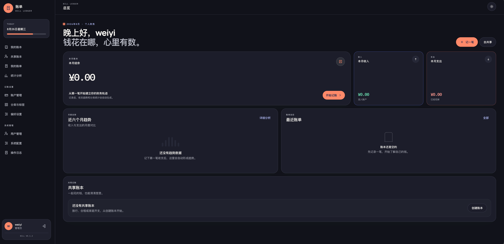
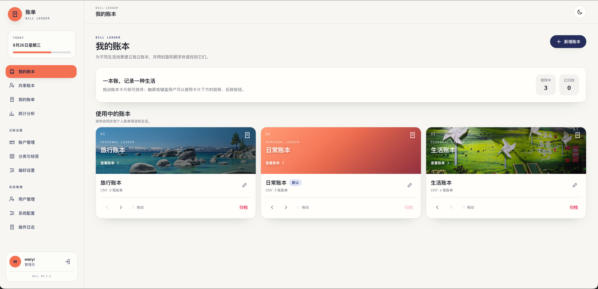

# 账单

面向个人、家庭、合租、旅行和小团队的多用户账单应用。支持个人收支统计，以及多人共同记账、灵活分摊、余额计算和补差结算；在飞牛 fnOS 上可通过 NAS 账号一键登录。

## 界面预览

| 总览（深色主题） | 我的账本（浅色主题） |
| --- | --- |
|  |  |

移动端：

<p align="center">
  
</p>

## 功能

### 个人记账

- 多用户与角色：开放注册可由管理员配置；第一个注册用户自动成为管理员
- 个人账本：个人账单必须归入账本，可按生活、交通、旅行等用途创建多个账本，支持排序、默认账本与归档
- 收支账户：支持银行卡（借记卡/信用卡）、微信、支付宝；银行卡卡号可暂不填写、稍后补充，仅保存指纹与尾号，不存完整卡号
- 分类与标签：分类最多支持两级，上级分类自动继承收支类型；账单支持多标签、芯片移除与回车新增
- 个人账单：收入、支出、账本、分类、标签、备注、时间、筛选、分页、CSV 导出
- 图片附件：个人与共享账单均可上传最多 9 张图片，支持缩略图、大图预览与原图下载
- 个人分析：支持全部或指定账本，提供区间汇总、收支趋势、分类、账本、标签和星期分布

### 共享账本

- 共享账本：创建、邀请、接受/拒绝、成员管理和归档
- 共同记账：共同支出与共同收入，明确付款人或收款人
- 四种分摊：等额、固定金额、百分比、份额
- 自动补差：计算每位成员应收/应付，并给出较少转账次数的结算建议
- 结算记录：把实际转账计入余额，支持回溯删除

### 账号与安全

- 记住登录：登录有效期可在 1–365 天间配置，默认 30 天；未勾选记住登录为 24 小时会话
- 密码找回：通过密保问题重置密码
- 管理员能力：用户管理、系统配置、审计日志、账号安全、API Key、上传、版本与健康检查

### 界面与发行

- 响应式界面：PC 侧边栏、手机底部导航；移动端筛选条件折叠、账单卡片化与底部抽屉弹窗；支持浅色、深色和跟随系统
- 飞牛 fnOS：支持 NAS 账号授权登录与账号绑定、自定义服务端口、URL 网关应用入口
- 发行方式：本地二进制、Docker、全平台压缩包与飞牛 fnOS 安装包

金额在服务端以整数“分”存储，避免浮点计算误差。个人数据按 `user_id` 隔离；共享账本接口会校验成员身份和所有者权限。

## 技术栈

- 后端：Go、Gin、GORM、SQLite（WAL）
- 前端：Vue 3、TypeScript、Vite、Pinia、Tailwind CSS
- 默认端口：`8907`
- 默认数据库：`data/db/bill.db`

## 本地运行

需要 Go、Node.js 20+ 和 npm。

```bash
make dev
```

浏览器访问 `http://localhost:8907`，首次注册的账号会自动成为管理员。
如果 `8907` 已被其他进程监听，`make dev` 会先停止该监听进程，再启动新的开发服务。

也可以分别运行：

```bash
# 终端一：后端
make start

# 终端二：前端开发服务器
cd web
npm ci
npm run dev
```

Vite 开发服务器会把 `/api` 和 `/uploads` 代理到 `http://localhost:8907`。

## 构建与测试

```bash
# 后端测试与静态检查
cd server
go test ./...
go vet ./...

# 前端类型检查与生产构建
cd web
npm ci
npm run build

# 完整构建，前端产物会复制到 server/static/dist
make build
```

## Docker

```bash
docker compose up -d --build
```

数据保存在 `bill-data` volume。应用健康检查地址为 `/api/health`。

指定版本的镜像部署见 `docker-compose.version.yml`，升级时修改镜像版本号后重新 `pull && up -d`。

## 飞牛 fnOS 安装

在飞牛 fnOS 应用中心安装或升级时，可自定义服务端口（默认 `8907`，范围 1024–65535）；运行设置中还可配置公开接口限流、CORS 来源与日志保留天数。

- 安装向导默认端口 `8907`；升级与运行配置留空则保持当前端口
- 安装完成后可通过飞牛 NAS 账号授权登录：首次创建的应用账号自动成为管理员并绑定当前 NAS 账号；已有账号可验证并绑定，避免数据孤岛
- 授权登录需在登录页/注册页手动点击并经账号确认后才继续，NAS 身份仅由可信 URL 网关传递
- 应用入口为 URL 网关新页面，不在网关入口暴露直接端口

## 发行

```bash
make build-all      # Linux、macOS、Windows
make build-docker   # 从 build-all 产物离线构建当前架构的 techfunways/bill 本地镜像
make fnpack         # 飞牛 fnOS amd64/arm64，需要 Docker 与 fnpack
```

发行产物位于 `release/<VERSION>/`，其中包含两个可直接部署的 compose 文件：

```bash
cd release/<VERSION>

# 指定版本：镜像标签已替换为当前版本，稳定部署
docker compose up -d

# latest 自动更新：配合 Watchtower 自动拉取新镜像并重启
docker compose -f docker-compose.latest.yml up -d
```

## 共享账本计算规则

共同支出中，付款人的余额增加，各参与人的分摊额从余额扣除；共同收入中，收款人的余额减少，各参与人的应得份额加入余额。正余额表示应收，负余额表示应付。记录结算后，付款人的负余额和收款人的正余额会同步抵消。

## 管理

管理员可在系统配置中关闭新用户注册、修改站点名称、设置记住登录有效天数和日志保留天数；也可管理用户状态、角色、密码及查看操作审计。运行日志默认保留最近 30 天，按 `logs/YYYYMM/info_YYYYMMDD.log`、`logs/YYYYMM/error_YYYYMMDD.log` 等格式写入数据目录，不输出到控制台。启动参数详见：

```bash
./bill -help
```
